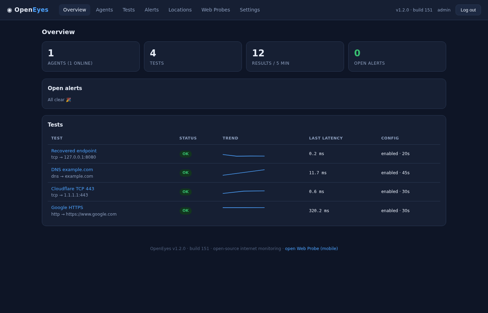
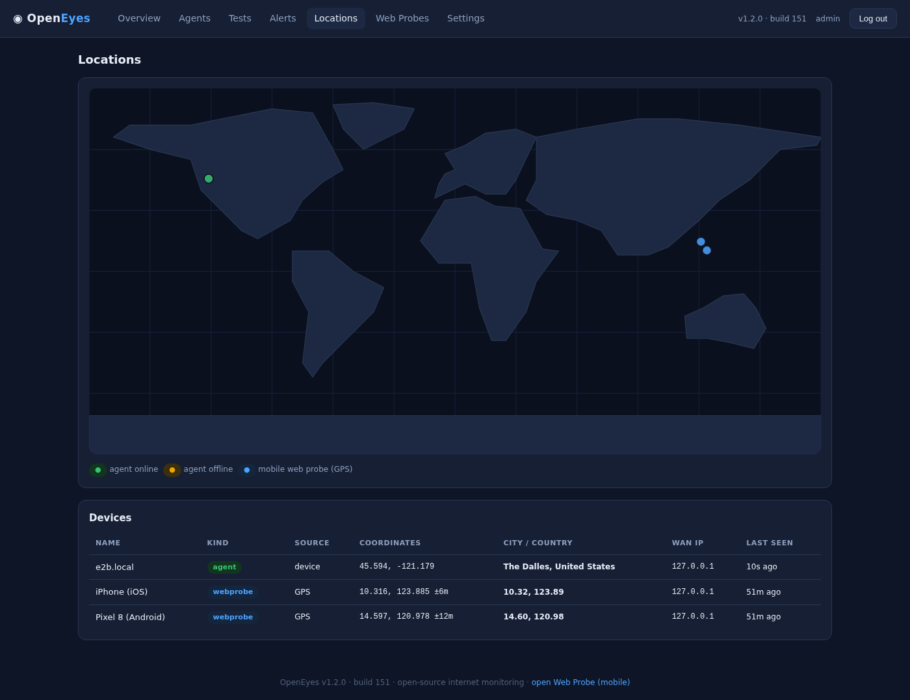
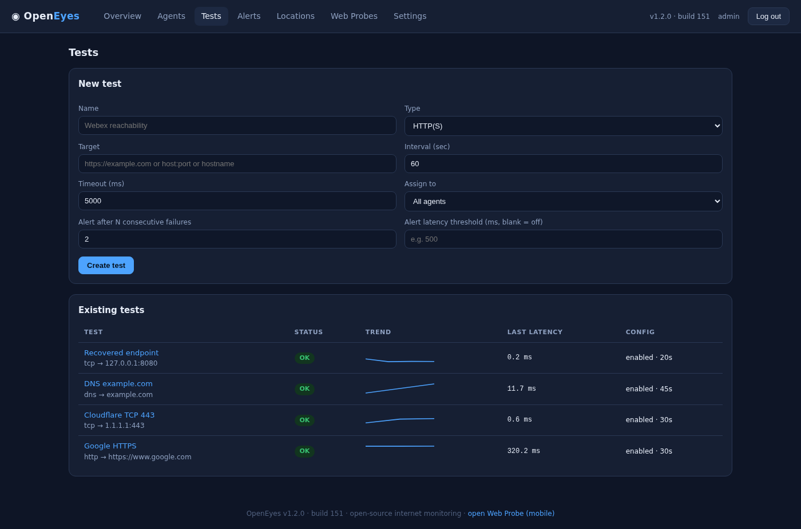
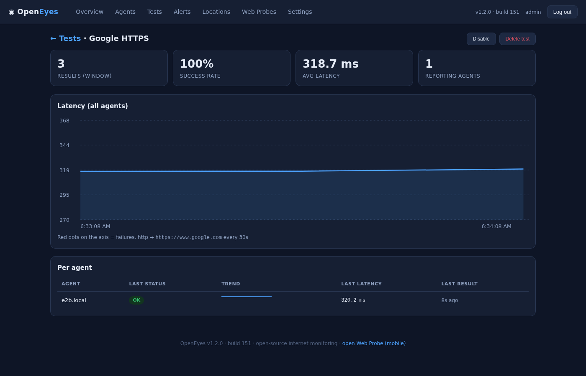
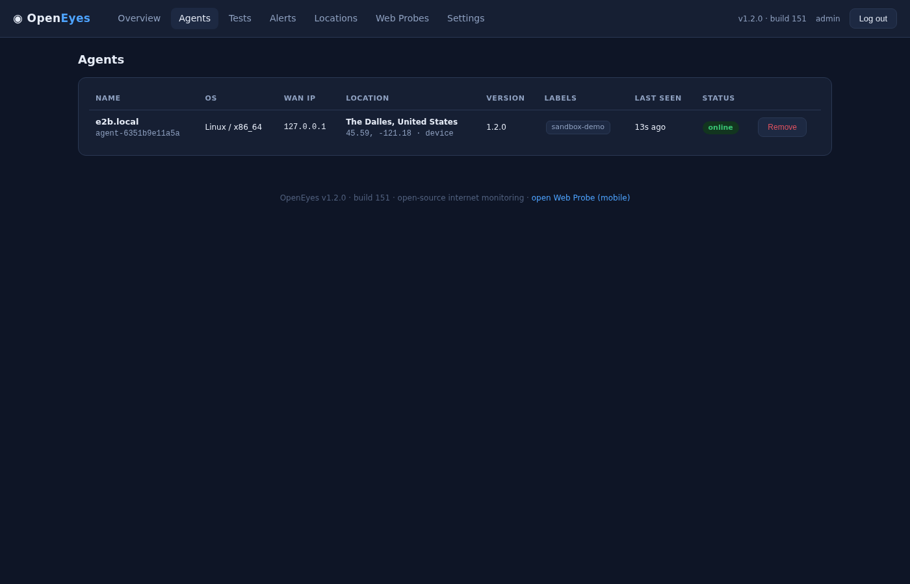
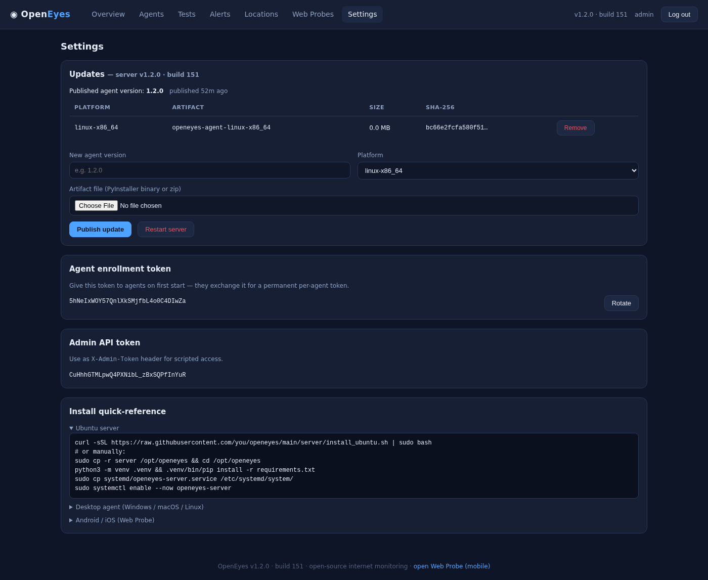
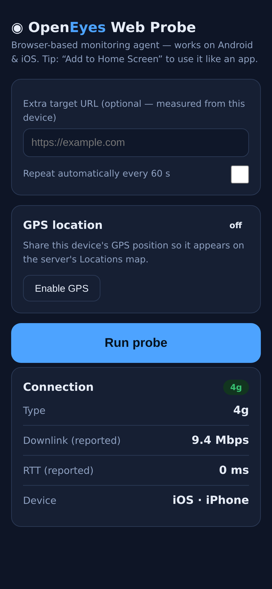
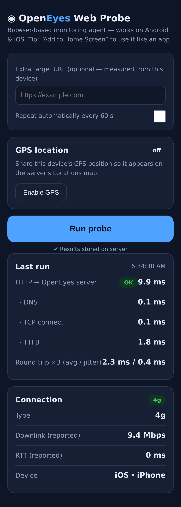

# ◉ OpenEyes

**OpenEyes — open-source internet & network monitoring.**

OpenEyes gives your IT team end-to-end visibility into the services you depend
on — from every office, server and phone — by running small synthetic probes
(HTTP, TCP, ping, DNS, traceroute) from distributed **agents** and collecting
the results on a central **server** with a live dashboard and alerting.

```
┌─────────────┐   HTTPS    ┌──────────────────────┐     poll config
│ Windows box │───────────▶│                      │◀────────────────┐
├─────────────┤            │   OpenEyes server    │                 │
│ macOS (M*)  │  results   │  (Ubuntu / FastAPI)  │   run probes    │
├─────────────┤───────────▶│                      │────────────────┐│
│ Linux host  │            │  dashboard · alerts  │                ││
└─────────────┘            │  SQLite · REST API   │                ▼│
┌─────────────┐            └──────────────────────┘        ┌──────────┐
│ Android/iOS │  browser probe (/probe)                    │  targets │
│  (browser)  │──────────────────────────────────────────▶ │ internet │
└─────────────┘                                            └──────────┘
```

## Screenshots

| | |
|---|---|
| **Overview** — fleet stats, alerts, test health | **Locations** — world map of agents & mobile devices |
|  |  |
| **Tests** — create & assign synthetic tests | **Test detail** — latency charts per agent |
|  |  |
| **Agents** — enrolled endpoints, WAN IP, location | **Updates** — publish agent releases, restart server |
|  |  |
| **Web Probe (mobile)** — Android & iOS, GPS optional | **Web Probe results** — latency measured from the device |
|  |  |

## Features

| Area | What you get |
|---|---|
| Server | FastAPI + SQLite (zero external deps), web dashboard, REST API, systemd-ready |
| Tests | HTTP(S) with DNS/TCP/TLS/TTFB phase timings, TCP port, ICMP ping (with graceful fallbacks), DNS (system resolver or DNS-over-HTTPS via Cloudflare/Google), traceroute |
| Assignment | Central test definitions assigned to **all agents**, **specific agents**, or **labels** |
| Alerting | Failure-streak alerts with automatic recovery, optional latency threshold |
| Agents | Pure-stdlib Python — runs on **Windows, macOS (Intel & Apple Silicon), Linux**; single-binary builds via PyInstaller |
| Autonomous | Zero-touch installers enroll & start the agent as a self-healing service; infinite enrolment retry with backoff; automatic re-enrolment after token rotation — **no user interaction after install** |
| Updates | Server-hosted release manifest; agents auto-check (6 h), verify SHA-256, self-replace and restart; publish from dashboard/API; in-place server restart endpoint |
| Location | **Locations map**: phones report **GPS** via the Web Probe; agents located by **WAN-IP geolocation** (server-side, cached) or fixed site coordinates in config |
| Mobile | **Web Probe**: a browser-based agent for **Android & iOS** — no install needed, "Add to Home Screen" for app-like use |
| Security | Admin login, per-agent tokens, rotating enrollment token, no plaintext secrets at rest |

## Repository layout

```
server/                 OpenEyes server (Ubuntu target)
  openeyes/             FastAPI application package
  systemd/              openeyes-server.service
  install_ubuntu.sh     one-shot Ubuntu installer
agent/                  OpenEyes agent (Windows/macOS/Linux)
  openeyes_agent/       pure-stdlib agent package + probes
  service/              systemd unit, launchd plist, Windows task script
  packaging/            PyInstaller build script (optional single binaries)
tests/                  pytest suite (unit + integration + end-to-end)
```

## Quick start

### 1. Server (Ubuntu 22.04+)

```bash
git clone <this repo> && cd openeyes/server
sudo bash install_ubuntu.sh
```

The installer creates a dedicated `openeyes` user, installs the app into
`/opt/openeyes`, and enables the `openeyes-server` systemd service. On first
start it prints (and stores in `/var/lib/openeyes/first_run.txt`) your:

* **admin password** – for the web dashboard (`http://<server>:8080/`)
* **enrollment token** – what agents use to join

Manual / development mode:

```bash
cd server
python3 -m venv .venv && .venv/bin/pip install -r requirements.txt
.venv/bin/python -m openeyes --host 0.0.0.0 --port 8080
```

> Put nginx/caddy with TLS in front for production, and open port 8080 (or
> your chosen port) in `ufw`.

### 2. Agents

The agent has **zero third-party dependencies** (Python 3.9+ stdlib only).

**Zero-touch install (recommended)** — one command per machine (or via your
MDM/GPO); afterwards the agent runs fully autonomously: it starts at boot,
restarts after crashes, retries enrolment until the server is reachable, and
re-enrols itself if its token is ever rotated:

```bash
# Linux / macOS (incl. Apple Silicon)
sudo SERVER_URL=https://eyes.example.com:8080 ENROLL_TOKEN=<token> \
     LABELS=branch-office LAT=14.5995 LNG=120.9842 \
     bash agent/install_agent.sh

# Windows (elevated PowerShell)
agent\Install-Agent.ps1 -ServerUrl https://eyes.example.com:8080 `
    -EnrollToken <token> -Labels "branch-office" -Lat 14.5995 -Lng 120.9842
```

**Enroll & run manually (any OS):**

```bash
cd agent
python3 -m openeyes_agent --server https://eyes.example.com:8080 \
    --enroll-token <TOKEN> --labels branch-office
```

The agent exchanges the enrollment token for a permanent per-agent token and
stores it in `~/.openeyes-agent/state.json` (chmod 600). After that the
enrollment token is no longer needed:

```bash
python3 -m openeyes_agent --server https://eyes.example.com:8080
```

Or use a config file (`agent.json.example` included):

```bash
python3 -m openeyes_agent --config agent.json
```

Useful flags: `--once` (run assigned tests once and exit — great for cron or
smoke tests), `--insecure` (accept self-signed TLS), `--labels a,b`.

**Run as a service**

| OS | Method |
|---|---|
| Linux | `service/openeyes-agent.service` (systemd) — adjust paths, then `systemctl enable --now openeyes-agent` |
| macOS (incl. Silicon) | `service/com.openeyes.agent.plist` → `sudo cp … /Library/LaunchDaemons/ && sudo launchctl load …` |
| Windows | PowerShell (admin): `service\install-windows-service.ps1` — registers a scheduled task that starts at boot and restarts on failure (or wrap with NSSM for a true service) |

**Optional single binaries** (e.g. for machines without Python):
`agent/packaging/build_binaries.sh` — run it on each target OS (PyInstaller
does not cross-compile). macOS builds run natively on Apple Silicon when run
on an M-series Mac.

### 3. Android & iOS — the Web Probe

Open `https://<server>:8080/probe` in the device browser and tap **Run
probe**. It measures HTTP latency to the server with full phase breakdown
(DNS/TCP/TTFB), 3× round-trip jitter, connection type (via the Network
Information API), and an optional external URL — then stores the result on
the server, where it appears under **Web Probes**.

Tip: use the browser's *Add to Home Screen* to install it like an app, and
enable *Repeat automatically* for continuous monitoring.

(Browsers cannot send ICMP or traceroute; the desktop agents cover those.)

## Locations (GPS + WAN IP)

Every device can appear on the **Locations** map:

* **Phones/tablets (Web Probe):** tap **Enable GPS** on `/probe` — the browser
  Geolocation API reports latitude/longitude/accuracy with each probe run.
* **Agents — WAN IP:** when an agent enrols or its source IP changes, the
  server geolocates the public WAN IP (ip-api.com, results cached 30 days,
  graceful when offline). Works with no configuration.
* **Agents — fixed site:** for known sites, set coordinates in the agent
  config (`"location": {"lat": …, "lng": …}`) or pass `--lat/--lng`. This
  takes precedence over IP geolocation.

Coordinate sources are labelled (`gps`, `config`, `wan-ip`) on the map and in
the Agents table.

## Updating server & agents

**Agents (automatic).** Publish a release once:

* Dashboard → *Settings → Updates*: pick a platform, choose the artifact
  (PyInstaller binary), enter the version, **Publish update**; or
* API: `PUT /api/v1/update/assets/<file>` with `X-Version` + `X-Platform`
  headers (admin auth).

Agents poll `/api/v1/update/manifest` every 6 hours (`update_check_sec`,
disable with `--no-update` / `"auto_update": false`). When a newer version is
published for their platform they download it, verify the **SHA-256** from
the manifest, replace their own executable, and exit — the service manager
(systemd / launchd / scheduled task) restarts them on the new version.
Source-mode installs log the available update instead of self-replacing.

**Server.** The portal shows the server version + build number in the header,
footer, Settings, and `GET /api/v1/version`. Use
*Settings → Restart server* (or `POST /api/v1/admin/restart`) for an in-place
restart after pulling new code — state lives in SQLite and survives.

```bash
git pull && sudo systemctl restart openeyes-server   # or the restart endpoint
```

## Using the dashboard

1. **Overview** — fleet stats, open alerts, test health with sparklines
2. **Agents** — enrolled agents, OS/arch, WAN IP, location, labels, status
3. **Tests** — create HTTP / TCP / ping / DNS / traceroute tests, set
   intervals, alert thresholds, and assignments; open a test for latency
   charts per agent
4. **Alerts** — open + resolved history
5. **Locations** — world map of agents (WAN IP / configured site) and
   mobile Web Probes (GPS), with a device table
6. **Web Probes** — browser-based probe runs (mobile devices) incl. GPS
7. **Settings** — tokens, **agent update publishing**, server restart

Everything on the dashboard is also available over REST with the admin token
(`Settings → Admin API token`, header `X-Admin-Token`), e.g.:

```bash
curl -H "X-Admin-Token: $TOKEN" https://eyes.example.com:8080/api/v1/results?test_id=test-123
```

## How alerting works

Each (test, agent) pair tracks a consecutive-failure streak. When the streak
reaches `params.alert_fail_streak` (default 2) an alert opens; the first
successful result after that resolves it automatically. Optionally set
`params.alert_latency_ms` to also alert on slow-but-successful probes.

## Security notes

* Admin sessions are signed, expiring cookies; the admin password is stored
  only as a SHA-256 hash after first boot.
* Agents hold unique random tokens; the server stores only their SHA-256.
* Enrollment and admin tokens can be rotated at any time from the dashboard.
* The web-probe ingest endpoint is intentionally unauthenticated (it's for
  phones) but stores only metrics + coarse IP/UA; put the server behind TLS.
* For internet exposure, serve behind a reverse proxy with TLS and consider
  firewall-restricting `/api/v1/webprobe/results`.

## Development & testing

```bash
cd openeyes
python3 -m pytest            # 36 unit + integration tests
make run-server              # dev server with local data dir
```

The suite covers: auth & sessions, enrollment/rotation, test CRUD +
validation, assignment rules, result ingest, the alert engine
(fire/dedupe/recover), every probe against local fixtures, traceroute output
parsers (Unix + Windows), and a full end-to-end cycle with a real uvicorn
server and the real agent runtime.

## License

MIT — see [LICENSE](LICENSE).
